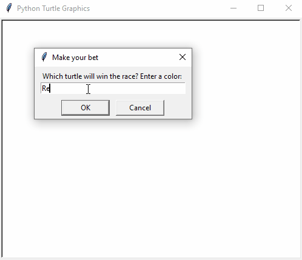

# Turtle Race

### This is a simple race in which some turtles compete. User has to bid for the winner.
## Summary
### In this Project I covered some more concepts of Turtle Graphics, Event listeners, instances and Higher Order Functions.
### Overall this was a nice project, and I learned many things doing this project.